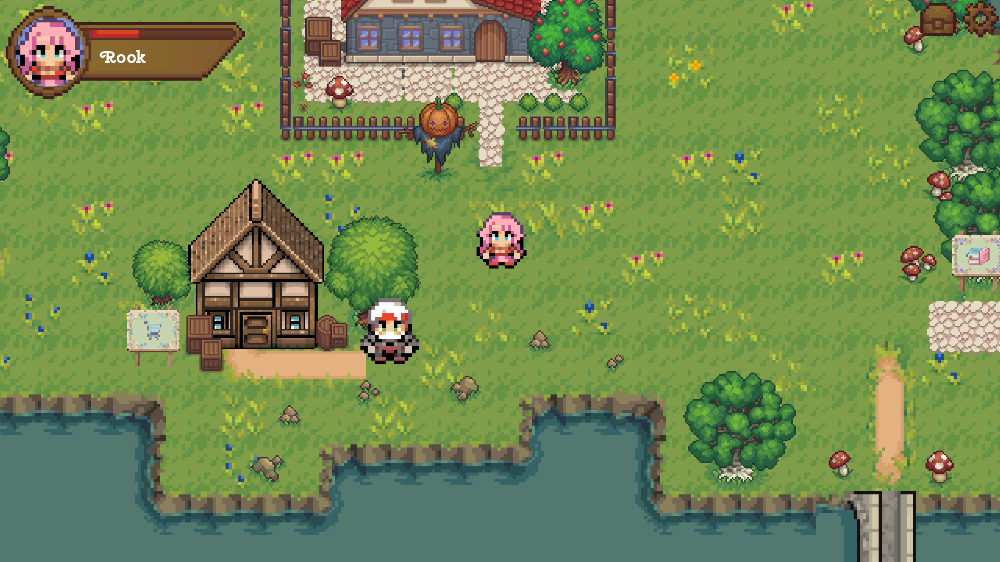

  
# ✨ My Pixel Life (Real Life Simulation RPG) ✨ 

A gamified life management RPG built with **Godot 4**, featuring an intelligent backend powered by **Google Gemini AI**, **Cloudflare Workers AI**, **Cloudflare D1**, and **Supabase**.

Transform your daily habits, study routines, workouts, meal plans, and wardrobe into an interactive pixel-art RPG world where completing real-life tasks earns your character XP, levels, and evolutions!

---

## Screenshots & Gameplay

<!-- 
Tavsiye: Ekran görüntülerinizi projenizin kök dizininde 'screenshots/' adında bir klasör açıp içine atabilirsiniz (örneğin: screenshots/town.png). 
Aşağıdaki yer tutucu linkleri kendi resim dosya isimlerinizle değiştirmeniz yeterlidir.
-->

  
  

  
  

---

## Play Online & Download

Experience the game directly in your web browser on **itch.io** or download the Android APK:

  
  

- **Web (Browser):** Play instantly on [itch.io (Real Life Simulation)](https://reallifesim.itch.io/reallifesimulationapp) without installing anything!
- **Android (Mobile):** Download the latest standalone `.apk` from the [Releases](https://github.com/simsekecem/RealLifeSimulationRPGApp/releases/latest) section.

> **Android Installation Note:** Since this is an indie build, your Android device may prompt *"Install unknown app"*. Enable the permission to proceed with installation.

---

##  Features & Gameplay

### Gym & Fitness
- Plan daily and weekly workout routines across muscle groups (*Chest, Back, Legs, etc.*).
- Chat with an **AI Fitness Coach** powered by Google Gemini that analyzes your past workout logs to give personalized advice.

### Library & Study Planner
- Track reading progress with books sorted by status (*Reading, To Read, Finished*).
- Schedule dedicated study sessions and ask the **AI Librarian** for book summaries and study motivation.

### Market & Smart Shopping
- Categorized shopping lists (*Groceries, Home Goods, Clothing, Personal Care*).
- Instant sync ensures you never forget groceries on the go.

### Restaurant & Meal Planning
- Plan weekly meals (*Breakfast, Lunch, Dinner, Snacks*).
- Consult the **AI Dietitian** for nutritional guidance and recipe suggestions.

### Smart Wardrobe & AI Stylist
- Snap or upload photos of real clothes to your virtual wardrobe.
- **Zero-Shot Vision AI (ViT):** Automatically recognizes clothing types (*upper, lower, dress, etc.*) and dominant colors.
- **Magic Button (AI Stylist):** Uses Gemini to generate personalized outfit recommendations from your virtual closet.

### Quests & Character Evolution
- **Static & Dynamic Quests:** Fresh daily challenges generated every morning via Gemini.
- Complete real-life tasks to gain XP. Reaching Level 2 unlocks new character visuals and evolutions!

### Smart Daily Push Notifications (FCM)
- Automated background checks remind you of unfinished workouts, unbought groceries, or pending study sessions throughout the day.

---

## Built With

- **Client:** [Godot Engine 4.5](https://godotengine.org/) (2D Pixel RPG)
- **Backend:** [Cloudflare Workers](https://workers.cloudflare.com/) (Serverless REST API)
- **Database:** [Cloudflare D1](https://developers.cloudflare.com/d1/) (Edge SQLite)
- **Generative AI:** [Google Gemini 2.5 Flash](https://ai.google.dev/) (Daily Quests, AI Coaches, Outfit Generator)
- **Computer Vision:** [Cloudflare Workers AI](https://developers.cloudflare.com/workers-ai/) (Vision Transformer / ViT for clothing classification)
- **Auth & Storage:** [Supabase](https://supabase.com/) (User Auth & Wardrobe Image Storage)
- **Notifications:** [Firebase Cloud Messaging (FCM)](https://firebase.google.com/docs/cloud-messaging)

---

##  Asset Credits & Acknowledgments

This game was made possible with the help of the following amazing free assets. A huge thanks to their creators!

- **Sky & Clouds Backgrounds:** [Free Sky with Clouds Background Pixel Art Set](https://free-game-assets.itch.io/free-sky-with-clouds-background-pixel-art-set)
- **Main Character's Home:** [Main Character’s Home – Free Top Down Pixel Art Asset](https://free-game-assets.itch.io/main-characters-home-free-top-down-pixel-art-asset)
- **Town Buildings & NPCs:** [Pixel Houses RPG Top Down Pixel Art Asset Pack 16x16 by kepx](https://kepx.itch.io/pixel-houses-rpg-top-down-pixel-art-asset-pack-16x16)
- **Coastal Furniture Set:** [Coastal Furniture Set by 0_mem0ry](https://0-mem0ry.itch.io/coastal-furniture-set-free)
- **Fancy Mansion Furniture Set:** [Fancy Mansion Furniture Set by 0_mem0ry](https://0-mem0ry.itch.io/fancy-mansion-furniture-set-free)
- **Environment & Overworld:** [Overworld Tileset – Grass Biome by Beast Pixels](https://beast-pixels.itch.io/overworld-tileset-grass-biome)
- **User Interface (UI):** [Free Basic Pixel Art UI for RPG](https://free-game-assets.itch.io/free-basic-pixel-art-ui-for-rpg)
- **Character Sprites:** [RPG Character Pack by farm-animal](https://farm-animal.itch.io/character-pack)
- **Background Music (BGM):** [City Date by Jan Hehr](https://janhehr.itch.io/city-date)

> [!NOTE]  
> All proprietary pixel art, sprites, music, and font files are excluded from this repository under `.gitignore` for copyright protection. The code is shared openly for architecture, backend integration, and gameplay logic demonstration.

---

## License

This project is licensed under the **MIT License**.
